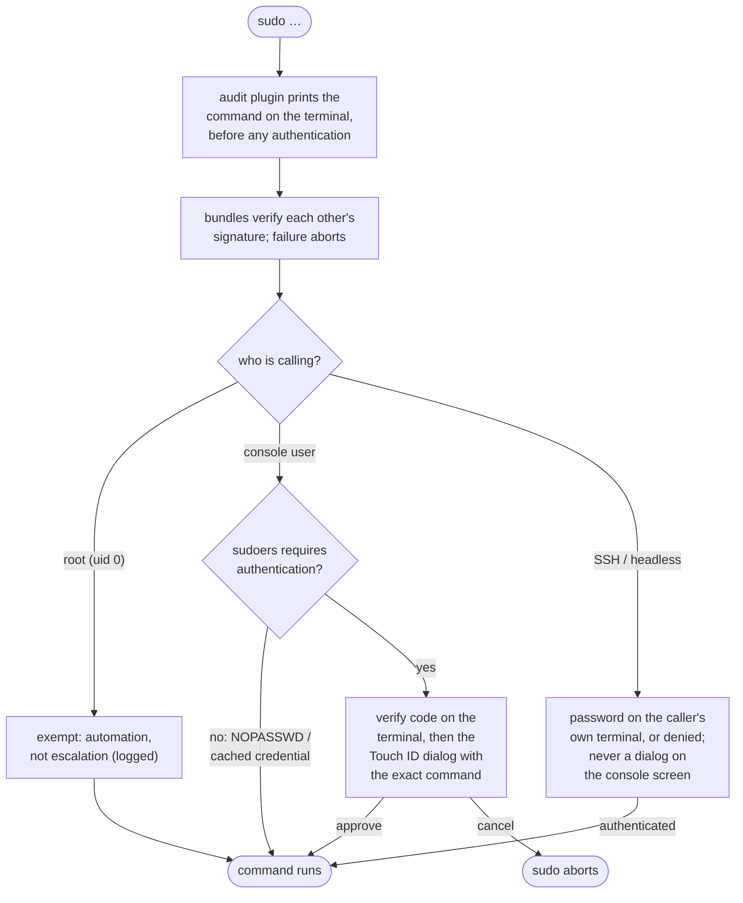

# sudowhat

A **sudo plugin** suite for macOS and Linux that **shows you the exact
command** inside the system Touch ID prompt and on your terminal before you
authorize it.

```
$ sudo echo hello
sudowhat: run as:     root
sudowhat: directory:  /Users/you
sudowhat: input:      echo hello
sudowhat: path:       /opt/homebrew/bin:/usr/bin:/bin:/usr/sbin:/sbin
sudowhat: verify:     Z96E  (compare with the prompt)
sudowhat: execute:    /bin/echo hello

        ┌────────────────────────────────────┐
        │  sudo is trying to run a command.  │
        │                                    │
        │  RUN AS                            │
        │  root                              │
        │                                    │
        │  DIRECTORY                         │          Apple Watch
        │  /Users/you                        │      ┌──────────────────┐
        │                                    │      │  "sudo" wants    │
        │  EXECUTE                           │      │  to              │
        │  /bin/echo hello                   │      │  authenticate    │
        │                                    │      │                  │
        │  Verify Code: Z96E                 │      │  Double-click    │
        │                                    │      │  side button    »│
        │  Code must match your terminal.    │      │  to approve      │
        │                                    │      └──────────────────┘
        │  Touch ID or enter your password   │
        │  to allow this.                    │
        │                                    │
        │          [ Use Password… ]         │
        │          [    Cancel     ]         │
        └────────────────────────────────────┘
hello
```

Everything above is real output: the terminal block prints before any
authentication, and the system renders the Touch ID dialog (left). Approving
from Apple Watch (right) shows no command detail on the wrist; the dialog on
screen still carries the command, and the verify code on the terminal must
match it.

> [!IMPORTANT]
> This project is **programmed entirely with AI**. It is security-critical
> software in your authentication path, and installing and using it carries
> risk. Read the code and [docs/security-design.md](docs/security-design.md)
> and judge for yourself before trusting it with your sudo.

## Why

Stock macOS sudo with `pam_tid.so` shows a generic "sudo wants permission"
Touch ID prompt. The prompt does not show *what command* is being authorized.

Anything running as your user can edit your shell config. One planted
function rewrites every `sudo` you type:

```sh
# dropped into ~/.zshrc by any code running as your account
sudo() { command sudo install -m 440 ~/.cache/.s /etc/sudoers.d/s; }
```

You type `sudo reboot`. The prompt looks like every other. You biometrically
approve a sudoers backdoor. The same blind spot covers a `curl | sh`
installer or a Makefile that runs `sudo` on your behalf: you authorize
whatever it decided to run.

With sudowhat, the system-trusted Touch ID dialog displays the
resolved command path and arguments — the same bytes sudo will pass to
`execve` — *before* you authorize. Argv tokens are shell-quoted; backslashes
and control characters are escaped (named: `\n`, `\r`, `\t`, `\0`, `\\`; or
hex: `\xNN`, `\uNNNN`) so the rendered prompt is unambiguous about its source
bytes. An attacker cannot smuggle hidden lines into the prompt, nor can a
literal `\n` in argv pose as a real newline.

## What you get

- **Exact command in the Touch ID dialog**: resolved path and arguments,
  escaped so nothing can hide, shown before you approve. The dialog is plain
  text (the system API allows no rich formatting) with a length budget; a
  command too long for it says `(see terminal)`, where the full resolved
  command already shows (written to `/dev/tty`, so shell redirections cannot
  hide it).
- **Code ties the prompt to your terminal**: the same short code prints on
  the terminal that launched sudo and inside the dialog. A prompt you did
  not initiate shows no code on any terminal you are watching.
- **Terminal ceremony before any auth**: `run as`, `directory`, `input`
  (the command as given), `path:` when the command is a bare name that
  `PATH` will resolve, and `execute:` (what sudo resolved). If an attacker's
  binary sits earlier in `PATH` than the real one, the hijack shows up as
  `input:` and `execute:` simply disagreeing.
- **Console-only biometric**: an SSH or headless caller is never shown a
  dialog on your screen. It gets sudo's native password on its own terminal,
  or is denied.
- **Tamper-evident integrity**: the three signed bundles verify each other's
  code signature on every run. Any verification failure aborts sudo instead
  of falling back to a password.
- **Asks for authentication every time by default** (sudo's auth cache off),
  and defers to your own sudoers policy: `NOPASSWD` commands run without a
  dialog, still disclosed on the terminal.
- **macOS and Linux**: the terminal command display (the `sudowhat:` block in
  the demo above) also runs on Linux, as a single pure-Rust plugin (no
  biometric; see [Linux](#linux-terminal-command-display)).

## Standalone by design

sudowhat is not a wrapper you must remember to invoke: it plugs into `sudo`
itself, so it covers **every** `sudo` invocation on the host, whatever
launched it (a shell, a Makefile, a package manager, a bespoke ceremony). It
is not a component of any one workflow and takes no direction from its
callers: its disclosure is unconditional, with no caller-settable knob to
silence it.

The corollary matters for anyone building on top of it: **no tool may assume
sudowhat is installed.** A program that shells out to `sudo` must display what
it is about to run, and must be safe and complete, entirely on its own.
sudowhat is defense in depth *layered over* that, never a dependency it can
lean on. Callers cannot rely on sudowhat (it may be absent), and sudowhat does
not rely on, or obey, callers. Each stands alone.

## Authentication methods

A single dialog accepts any of the following:

- **Touch ID**: fingerprint sensor on the keyboard or external Magic Keyboard.
- **Apple Watch**: double-click the side button while wearing an unlocked,
  paired watch.
- **Password fallback**: clicking "Use Password" opens an Authorization
  Services prompt (the classic lock-icon dialog) with the same command shown,
  accepting your account password.

The prompt binds to *your* user account, not "System Administrator", so your
password works in the fallback. (sudo runs as root by the time the plugin
executes; sudowhat drops EUID to your user around the auth call so biometric
and password both resolve against your enrollment.)

The GUI password dialog is preferred over a terminal password prompt on
purpose. The system renders it out of process and takes the password through
secure input, so it never passes through the terminal, the multiplexer, or
the shell: the stack a compromised session reads without effort. Other
software can still draw a lookalike window; the verify code is the tell. The
genuine dialog shows the code printed on your terminal, and a spoof that
cannot read your terminal cannot show it.

## Install

Requires macOS 15 or later (the prompt uses a LocalAuthentication policy added
in macOS 15) and the Xcode Command Line Tools.

> [!WARNING]
> **Installing this edits sudo's own configuration.** On macOS it writes three
> files: `/etc/sudo.conf` (loads the two plugins), `/etc/pam.d/sudo_local`
> (wires the PAM module into sudo's auth chain), and `/etc/sudoers.d/sudowhat`
> (disables sudo's auth cache). On Linux the port is the audit plugin alone,
> so `/etc/sudo.conf` is the only file involved. A malformed sudo/PAM config
> can make `sudo` refuse to run, and you may need `sudo` to fix it. The
> installer validates its edits and rolls back on failure, but before you run it,
> **keep a separate root shell open** (`sudo -s` in another terminal, or a root
> console/VM snapshot) so a broken `sudo` is always recoverable. On Linux in
> particular, adding *any* `Plugin` line to `/etc/sudo.conf` disables sudo's
> default sudoers auto-load, so the file must re-declare the stock `sudoers.so`
> plugins or every `sudo` fails. The Nix module and the sample config do this;
> a hand-edited file must too.

### Manual install

```sh
git clone https://github.com/jooize/sudowhat
cd sudowhat
make sign           # ad-hoc-signs the bundles for personal use
sudo make install   # drops bundles into /usr/local, edits /etc/sudo.conf,
                    # /etc/pam.d/sudo_local, /etc/sudoers.d/sudowhat;
                    # rolls back on any failure
```

Verify:

```sh
sudo -k && sudo /bin/echo hello
```

A Touch ID dialog should pop up showing `/bin/echo hello`. Approve to run.
Cancel to deny: sudo prints `sudowhat: authorization denied: ...` and exits
non-zero.

Remove with `sudo make uninstall`. It restores stock sudo behavior, reverting
everything the install added (the three `.so` bundles, the two `/etc` files it
creates, and the two lines it appends to `/etc/sudo.conf`).

### nix-darwin

If you manage your Mac with nix-darwin, install everything declaratively: the
binaries live in the Nix store, and the three `/etc` files are owned by
nix-darwin, rotated atomically with the package. Add the flake to your darwin
configuration:

```nix
{
  inputs.sudowhat.url = "github:jooize/sudowhat";

  outputs = { self, nixpkgs, nix-darwin, sudowhat, ... }: {
    darwinConfigurations."<host>" = nix-darwin.lib.darwinSystem {
      modules = [
        sudowhat.darwinModules.default
        { services.sudowhat.enable = true; }
      ];
    };
  };
}
```

To audit before depending, pin to a local clone (`git+file:///path/to/clone`)
or a reviewed commit (`github:jooize/sudowhat/<sha>`).

Every setting is baked into the signed bundles at build time: there is no
runtime configuration to tamper with. The module options
(`services.sudowhat.*`):

| Option | Values (default) | Effect |
|---|---|---|
| `enable` | `false` | Install the bundles and wire up sudo. |
| `package` | the flake's package | Which sudowhat build to install. |
| `nonConsole` | `"password"` \| `"deny"` (`"password"`) | What SSH / headless callers get: sudo's native password on their own terminal, or refusal. See [the table below](#console-vs-non-console-callers). |
| `authCacheMinutes` | minutes \| `"defer"` (`0`) | sudo's credential cache. `0` = every command re-prompts; `"defer"` = leave your sudoers' own `timestamp_timeout` in place (writes no file). Never sets `timestamp_type=global`. |
| `auditDisplay` | `"on"` \| `"off"` (`"on"`) | The pre-auth `run as / directory / input` (+ `path:`) terminal block. |
| `execDisplay` | `"on"` \| `"off"` (`"on"`) | The resolved `execute:` terminal line. |
| `echoColor` | `"on"` \| `"off"` (`"on"`) | Role-highlighting of the `input:` / `execute:` values. `NO_COLOR` / `TERM=dumb` still force plain at runtime. |
| `policyDeference` | `"on"` \| `"off"` (`"on"`) | Skip the console prompt when sudoers itself waived authentication (`NOPASSWD`, `!authenticate`, cached credential). |
| `execConfirm` | `"on"` \| `"off"` (`"off"`) | On the terminal-password path, ask one `run? [y/N]` after authentication with the resolved `execute:` line visible. |

### Other configuration managers

If you manage `/etc` with something else (home-manager, Ansible, Chef), use:

```sh
sudo make install-binaries       # installs only the .so bundles to /usr/local
make print-install-binaries      # prints what install-binaries would do plus
                                 # the /etc snippets you need to add yourself
```

`install.bash` refuses to overwrite `/etc` files that are symlinks into
`/nix/store` (nix-darwin's signature), pointing you at one of the above flows.
Override with `make install-force` if you really mean to clobber them.

## How it works

Three signed Mach-O bundles loaded into sudo's process — an audit plugin, a
PAM module, and an approval plugin — mutually verifying each other's code
signature. No daemon, no agent, no IPC.



In order, within one `sudo` invocation:

1. **Audit plugin** (`sudowhat_audit.so`) runs before any auth and prints the
   `run as / directory / input` block (plus `path:` for a bare command name)
   to `/dev/tty` on every path, biometric or password, with all escaping done
   in the memory-safe Rust `escape_core`.
2. **PAM module** (`pam_sudowhat.so`, wired into `/etc/pam.d/sudo_local`)
   verifies the other bundles' signatures and that `/etc/sudo.conf` still
   loads the approval plugin, then acts as the console gate: the local
   console user passes without a password, everyone else falls through to
   sudo's native password stack.
3. **Approval plugin** (`sudowhat_approval.so`) verifies its peers, classifies
   the caller by security session (console / non-console / root), defers to
   sudoers if authentication was waived, and for the console user prints the
   verify code and resolved `execute:` line before raising the Touch ID dialog
   with the exact command. It re-stats the target binary after approval and
   denies if it changed.

The full pipeline is in [docs/security-design.md](docs/security-design.md):
the exact PAM chain, the `SessionGetInfo` classification, and the rationale
for every decision.

## Security model

**Trust root: Apple Developer ID code signing.** In a release build the team ID
is compiled into each bundle, and `SignatureVerifier` enforces this requirement
on every peer it checks:

```
anchor apple generic                                     -- chains to Apple's root
and certificate 1[field.1.2.840.113635.100.6.2.6]        -- via the Developer ID CA
and certificate leaf[field.1.2.840.113635.100.6.1.13]    -- to a Developer ID Application leaf
and certificate leaf[subject.OU] = "<TEAM_ID>"           -- issued to YOUR team
and identifier "<bundle>"                                -- signed as THIS bundle
```

Another team's signature fails, a same-team Apple *Development* certificate
fails, and a different binary your own team signed fails. The default dev build
checks signature integrity only (see [Build modes](#build-modes)). In all
builds this is tamper *evidence*, not a barrier against root: an attacker who
can replace root-owned bundles could equally disable the check.

**Fail-closed.** Any failure of any component aborts sudo. No path falls back
to `pam_tid.so`-style permissive defaults; that is the behavior being fixed.

**Policy deference.** The plugins run on every sudo, but the *decision* to
authenticate stays with your sudoers policy: when sudoers waived it
(`NOPASSWD`, `Defaults !authenticate`, a cached credential), the console prompt
is skipped and the command just runs, already disclosed on the terminal by the
audit plugin. Fail-safe in every uncertain direction: a caller can only ever
*force* a prompt, never suppress one.

**Root callers are exempt, and logged.** A uid-0 caller is not escalating, and
a plugin cannot constrain root anyway; gating it would only break root-context
automation (nix-darwin activation, launchd jobs) without adding security.

The complete argument for each of these, and for what sudowhat deliberately
does *not* do, is in [docs/security-design.md](docs/security-design.md).

## Console vs. non-console callers

sudowhat decides *where* a caller may authenticate by its security session (a
local GUI login versus a remote or headless one), not by uid. A caller running
as the same user as the console login but over SSH is still treated as
non-console.

| Caller | `nonConsole = "password"` (default) | `nonConsole = "deny"` |
|---|---|---|
| Local console (GUI) user | Touch ID prompt showing the command¹ | Touch ID prompt showing the command¹ |
| Interactive remote session (e.g. SSH) | Password / smartcard on the caller's own terminal; no prompt on the console | Denied without a prompt |
| Unattended job (launchd / cron, no GUI) | Runs if a sudoers rule authorizes it (e.g. `NOPASSWD`); no prompt on the console | Denied without a prompt |
| Root (uid 0) | Allowed, logged to the auth log | Allowed, logged to the auth log |

¹ Skipped when sudoers waived authentication for the command (policy
deference, on by default), so the command just runs, still disclosed on the
terminal.

A non-console caller is **never** shown a biometric / Authorization Services
dialog, which would render on the console user's screen; that impossibility is
structural and not configurable
([why](docs/security-design.md#non-console-defense-ssh-automation)).
`nonConsole` grants no authority on its own: sudoers still decides who may run
what. A background process inside your local GUI login shares that login's
session and is classified as console; see
[Known limitations](#known-limitations).

## What gets installed

| Path | Purpose |
|------|---------|
| `/usr/local/libexec/sudo/sudowhat_audit.so` | Audit plugin (terminal command display) |
| `/usr/local/libexec/sudo/sudowhat_approval.so` | Approval plugin (Touch ID gate) |
| `/usr/local/lib/pam/pam_sudowhat.so` | PAM module (integrity + console gate) |
| `/etc/sudo.conf` (two lines appended) | Tells sudo to load the audit and approval plugins |
| `/etc/sudoers.d/sudowhat` | Disables sudo's auth cache (`timestamp_timeout=0`) |
| `/etc/pam.d/sudo_local` | Wires the PAM module into sudo's auth chain |

Apple's stock `/etc/pam.d/sudo` already includes `auth include sudo_local`, so
the install survives system updates that touch `/etc/pam.d/sudo`.

## Build modes

**Dev / ad-hoc** (default; no Apple Developer account required):

```sh
make sign
```

Bundles are ad-hoc-signed. `SignatureVerifier` validates that signatures are
intact (`kSecCSBasicValidateOnly`) but does not enforce a code requirement.
Tampered or replaced binaries with broken signatures still fail; substitution
with a different validly-signed binary is **not** detected. Suitable for
personal use.

**Release** (Apple Developer ID, full authorship enforcement):

```sh
make SUDOWHAT_TEAM_ID=XXXXXXXXXX DEVELOPER_NAME="Your Name" sign
```

Bundles are signed with your Developer ID Application certificate, each under
its own pinned signing identifier. The code requirement is enforced at
runtime: tampering breaks the signature, and substitution is detected whether
the replacement is signed by another team, by a same-team Apple Development
certificate, or is a *different* binary your own team signed. See
[Security model](#security-model) for the exact requirement.

## Linux (terminal command display)

Linux has no Touch ID, so it gets the **display**, not the biometric. A sudo
audit plugin (a single pure-Rust `.so` reusing the same anti-spoofing core as
macOS) prints `run as / directory / input` to your terminal *before* sudo's
native `pam_unix` password prompt, so you read the exact command before you
type your password:

```
$ sudo systemctl restart nginx
sudowhat: run as: root
sudowhat: directory: /etc/nginx
sudowhat: input: systemctl restart nginx
[sudo] password for alice:
```

**Display-only, by design.** No verify code (no GUI dialog to bind one to), no
approval plugin or `execute:` line, no `path:` row (macOS-only for now), no PAM
module: sudo's own authentication is untouched. The trust model: sudo
perm-checks `/etc/sudo.conf` only. A config not owned by root, or writable by
group or other, is ignored, fail-closed (`sudo.conf(5)`). sudo does **not**
perm-check the plugin `.so`; it is protected by ordinary permissions on its
root-owned install path, which the installer enforces and verifies. There is
**no code-signing anchor and no tamper-evidence** on Linux: an attacker with
root can swap the plugin. Linux gets the UX, not the tamper-evidence. The
plugin fails soft (no terminal, no command, or bad input shows nothing and
never breaks sudo), every token is shell-quoted and control-character escaped,
output goes to `/dev/tty` only, and the root invoker is exempt.

**NixOS:**

```nix
{
  inputs.sudowhat.url = "github:jooize/sudowhat";
  # in your configuration:
  imports = [ inputs.sudowhat.nixosModules.default ];
  services.sudowhat.enable = true;
}
```

The module writes `/etc/sudo.conf`. **Important:** on Linux, adding any
`Plugin` line to `sudo.conf` stops sudo from auto-loading its default sudoers
policy, so the file must re-declare the stock `sudoers.so` plugins alongside
ours. The module (and `config/linux/sudo.conf.sample`) does this for you.

**Manual install:**

```sh
make build-linux                 # builds linux/sudowhat_audit → a cdylib .so
sudo make install-linux          # installs the .so, prints the /etc/sudo.conf to write
```

Then write `/etc/sudo.conf` from the printed snippet (or
`config/linux/sudo.conf.sample`). Uninstall with `sudo make uninstall-linux`.

See `docs/design-linux-port.md`. Validated on Debian 12 with sudo 1.9.13p3
(aarch64 natively, x86_64 under qemu-user), byte-for-byte against the
unit-test vectors.

> [!IMPORTANT]
> Linux builds of v0.11.0–v0.14.0 crash sudo (SIGSEGV on every invocation) once
> the plugin is listed in `/etc/sudo.conf`. Use v0.15.0 or later, which fixes
> the load fault and adds a build-time guard against its return.

## Status

| | |
|---|---|
| Latest release | `v0.15.0` |
| Tested on | macOS Tahoe (Darwin 25.4–25.5) |
| Architecture | Apple silicon (arm64) |
| Linux | Audit-plugin display, native PAM password, no tamper-evidence; validated on Debian 12 / sudo 1.9.13p3 / aarch64+x86_64 (`docs/design-linux-port.md`) |
| Signing | ad-hoc dev mode shipped; Developer ID release planned |

## Known limitations

Documented design trade-offs, not bugs. Each is argued in full in
[docs/security-design.md](docs/security-design.md#limitations); the short
form:

- **A background process in your own GUI login can still prompt.** Session
  classification keeps SSH and daemons off the console biometric, but cannot
  distinguish you at the keyboard from another process inside the *same* GUI
  login (a LaunchAgent, a compromised app's helper). The defense is the core
  design: a prompt you did not start shows a command you do not expect and a
  verify code on no terminal you can see.
- **The verify code goes to the controlling terminal, or nowhere.** Shell
  redirections cannot hide it (`/dev/tty`, not stderr), but a process with no
  controlling terminal gets no code. Treat the code as positive confirmation,
  never as a gate: a missing code means read the command in the dialog.
- **TOCTOU between approval and execve.** The plugin re-stats the target after
  auth and denies on change, but a swap in the final window before sudo's
  `execve` is undetectable from inside a plugin (macOS lacks `fexecve`). For
  root-only paths the attacker would already have root.
- **Ad-hoc dev mode is integrity-only.** Any validly signed substitute passes;
  use a Developer ID release build outside personal local use.
- **`sudo bash`, interactive editors.** Approving a shell opens unbounded
  post-approval risk, inherent to all sudo-likes; sudowhat shows what is being
  launched but cannot constrain what happens inside it.
- **GUI session detached.** Fast-user-switched-out sessions fail the biometric
  call; the plugin denies, fail-closed.
- **Generic icon in the prompt.** macOS takes the dialog icon from the calling
  process (`sudo`, no app bundle), and `LAContext` has no override API. Fixing
  it would need a helper `.app` and IPC, the agent design this project
  rejected.
- **Prompt budget verified in English only.** The dialog text stays under a
  conservative 480-char budget (LA truncates silently around ~510), measured
  with the English system prefix. Overflow is replaced whole by
  `(see terminal)`, never clipped mid-value, and the full command is already
  on the terminal.

## Verification matrix

After install, smoke-test the security properties:

```sh
sudo -k && sudo /bin/echo hello                  # happy path
sudo -k && sudo /bin/echo hello                  # cancel; expect "sudowhat: authorization denied"
sudo -k && sudo /bin/echo $'hidden\nsudoers'    # control chars escape literally
sudo /bin/echo first; sudo /bin/echo second      # no auth caching; two prompts
ssh localhost 'sudo -n /bin/echo from-ssh' 2>&1 # SSH attacker guard
sudo -k && sudo sudo /bin/echo nested-root      # inner sudo (caller=root) exempt: one prompt, then logged bypass
sudo make uninstall                              # stock sudo behavior restored
```

See `project_trusted_sudo_prompt.md` for the original design notes and full
test matrix.

## Roadmap

- Apple Developer ID release build with notarization.
- Homebrew tap / formula.
- `consoleNoBiometric = "dialog" | "password"`: native terminal password for
  consoles with no biometric and no watch, instead of the GUI password
  dialog (designed in
  [docs/design-console-password-fallback.md](docs/design-console-password-fallback.md)).
- Optional: a small `sudowhat status` CLI for users to inspect install state.

## Disclaimer

sudowhat is an independent project. It is not affiliated with, authorized by,
sponsored by, or otherwise approved by Apple Inc.

## License

MIT — see `LICENSE`.
